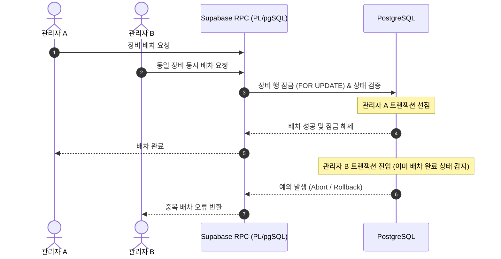

# 산업 장비 임대 및 배차 관리 시스템 (Equipment Rental & Dispatch Management)

현장 중심의 비즈니스 로직을 자동화하여 수기 장부 관리의 병목을 해결하고, 데이터 정합성 보장을 위해 1인 풀스택으로 구축한 사내 웹 애플리케이션입니다.

---

## 1. 프로젝트 배경 및 문제 정의

* **배경**: 발전기 및 산업용 컴프레셔 임대 현장에서는 장비 배차, 회수, 현장 간 직송(스윙 배차)이 수기 장부와 전화/메신저로 관리되어 잦은 휴먼 에러 발생
* **직면 과제**:
  1. **동시 배차 충돌(Race Condition)**: 다수의 관리자가 동일 장비를 서로 다른 현장에 중복 배정하는 문제
  2. **오출고 리스크**: 정비 또는 점검이 완료되지 않은 결함 장비가 현장으로 오출고되는 문제
  3. **데이터 유실**: 현장 간 직송 시 이전 전표 마감 및 신규 인계 수량 처리가 분리되어 장비 위치 왜곡 발생
* **해결 목표**: 현장 프로세스를 데이터베이스 트랜잭션 및 인라인 검증으로 강제하여 휴먼 에러를 원천 차단

---

## 2. 핵심 기술 스택

* **Frontend**: Next.js 14+ (App Router), TypeScript, Tailwind CSS, shadcn/ui, Lucide Icons
* **Backend & Database**: Supabase, PostgreSQL, PL/pgSQL (RPC)
* **Performance & Utilities**: IntersectionObserver, date-fns

---

## 3. 핵심 아키텍처 및 문제 해결

### ① DB 레벨 동시성 제어 및 오출고 차단 (RPC & Row Locking)
* **문제**: 프론트엔드 레벨 검증만으로는 네트워크 지연 시 거의 동시에 발생하는 중복 배차 요청을 막을 수 없음
* **구현**: 
  * Supabase PostgreSQL RPC 함수 내부에서 장비 레코드 수정 시 행 수준 잠금(`FOR UPDATE`)을 적용하여 원자적 처리 보장
  * 배차 승인 쿼리 실행 직전 장비의 `status`(정상 가동 가능 여부)를 검증하여 정비 대상 장비는 트랜잭션 단계에서 예외(ROLLBACK) 처리



### ② 복합 비즈니스 로직의 단일 트랜잭션화 (스윙 배차)

* **문제**: A 현장의 장비가 입고되지 않고 곧바로 B 현장으로 직송되는 '스윙 배차' 시, 이전 계약 종료와 신규 계약 생성이 엇갈리면 장비 대여료 청구 및 위치 추적이 어긋남
* **구현**: 이전 전표의 회수 마감, 신규 현장 계약서 생성, 결합 장비(용접기 등) 수량 분할 인계를 단일 RPC 함수 내 하나의 트랜잭션으로 묶어 실패 시 자동 롤백되도록 설계

### ③ 렌더링 최적화 (IntersectionObserver 지연 로딩)

* **문제**: 500대 이상의 장비 상태 카드와 운용 캘린더를 동시 렌더링할 때 초기 DOM 노드 과다 생성으로 스크롤 버벅임 발생
* **구현**: 브라우저 내장 API인 `IntersectionObserver`를 활용하여 뷰포트에 진입하는 일정 청크 단위로 DOM 노드를 마운트하여 렌더링 부하를 분산시키고 프레임 저하 방지

---

## 4. 주요 기능

* **실시간 장비 현황 대시보드**: 가동 중, 대기, 정비 필요 장비의 상태를 카드 그리드로 실시간 시각화
* **배차 관리 캘린더**: 날짜별 출납 및 회수 예정 장비를 캘린더 인터페이스로 통합 관리
* **장비 로케이션 트래킹**: 사내 야지/창고 보관 구역 간 이동 처리 및 현장 위치 추적

---

## 5. 로컬 개발 환경 실행 방법

### 환경 설정 (.env.local)

루트 경로에 `.env.local` 파일을 생성하고 Supabase 프로젝트 키를 입력합니다.

```bash
NEXT_PUBLIC_SUPABASE_URL=https://your-project.supabase.co
NEXT_PUBLIC_SUPABASE_ANON_KEY=your-anon-key
```

### 패키지 설치 및 실행

```bash
# 의존성 설치
npm install

# 개발 서버 실행
npm run dev
```

브라우저에서 `http://localhost:3000`으로 접속하여 결과를 확인합니다.
